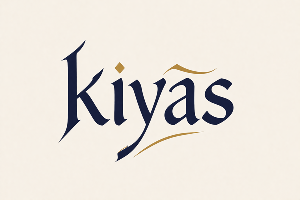

<p align="center">
  
</p>

<p align="center">
  <strong>AI-Powered Design Fidelity — MCP Server &amp; CLI</strong><br>
  <em>"comparison" — pronounced "key-AHS"</em>
</p>

---

A developer-first **MCP server** (also runnable as a CLI) that compares Figma designs against rendered UI components and surfaces an AI-powered semantic diff. Plugs into Claude Code, Cursor, Codex CLI, and any other MCP-compatible client.

Unlike pixel-diff tools, kiyas uses vision AI to understand _what_ is different and _why_ it matters — outputting actionable, human-readable feedback like:

- "border-radius is 8px in implementation but 12px in design"
- "spacing between title and subtitle is 16px tighter than the design"

Just describe the component by name. kiyas finds it in your codebase, screenshots it, and compares it against the Figma design.

---

## How It Works

```
                          ┌─────────────────────┐
                          │  kiyas               │
                          │  (MCP server / CLI)  │
                          │                      │
                          │  figma + target      │
                          │  / component         │
                          └──────────┬───────────┘
                                     │
                      ┌──────────────┼──────────────┐
                      ▼              ▼               ▼How
              ┌──────────────┐ ┌───────────┐ ┌─────────────┐
              │ 1. Auth      │ │ 2. Figma  │ │ 3. Resolve  │
              │              │ │  Capture  │ │  Component  │
              │ Verify       │ │           │ │             │
              │ Claude Code  │ │ Export    │ │ AI agent    │
              │ or Codex CLI │ │ frame as  │ │ searches    │
              │ is installed │ │ PNG via   │ │ codebase,   │
              │ & signed in  │ │ Figma     │ │ finds URL + │
              │              │ │ REST API  │ │ CSS selector│
              └──────┬───────┘ └─────┬─────┘ └──────┬──────┘
                     │               │               │
                     │               ▼               ▼
                     │        ┌────────────┐  ┌────────────┐
                     │        │  Figma     │  │ Playwright │
                     │        │  design    │  │ screenshot │
                     │        │  (PNG)     │  │ (PNG)      │
                     │        └─────┬──────┘  └─────┬──────┘
                     │              │               │
                     │              └───────┬───────┘
                     │                      ▼
                     │          ┌──────────────────────┐
                     └─────────►│ 4. Vision AI Compare │
                                │                      │
                                │ Both images sent to  │
                                │ Claude Code CLI with │
                                │ a structured prompt   │
                                │                      │
                                │ Returns JSON array   │
                                │ of discrepancies     │
                                └──────────┬───────────┘
                                           │
                                           ▼
                                ┌──────────────────────┐
                                │ 5. HTML Report       │
                                │                      │
                                │ Side-by-side images  │
                                │ Severity badges      │
                                │ Interactive filters  │
                                │ HIGH / MEDIUM / LOW  │
                                │                      │
                                │ file:// link in      │
                                │ terminal output      │
                                └──────────────────────┘
```

**Step-by-step:**

1. **Authenticate** — kiyas delegates AI calls to the Claude Code or Codex CLI. Your existing subscription handles everything — no API keys needed.
2. **Export Figma design** — Parses the Figma URL, calls the Figma REST API to export the frame as a 2x PNG, and fetches node metadata (colors, fonts, spacing).
3. **Resolve component** — An AI agent scans your codebase (file tree, routes, components) and maps your natural-language description to a URL on your dev server + a CSS selector.
4. **Screenshot implementation** — Playwright launches headless Chromium, navigates to the resolved URL, and captures the component.
5. **AI comparison** — Both PNGs are passed to the Claude Code CLI with a structured prompt. The AI identifies every discrepancy with specific CSS properties and values.
6. **Report** — Results are formatted into an HTML report with side-by-side image comparison, severity badges, and interactive filters. A file link is printed to the terminal for easy access.

---

## Use as an MCP Server

kiyas exposes its comparison engine as an [MCP](https://modelcontextprotocol.io) server over stdio. Three tools, all with Zod-typed input schemas:

| Tool              | Description                                                                 | Required input                |
| ----------------- | --------------------------------------------------------------------------- | ----------------------------- |
| `compare`         | Run a fresh Figma-vs-implementation comparison; returns `reportId` + summary | `figma` + (`target` or `component`) |
| `get_diff_report` | Fetch a stored report's HTML or JSON content                                | `reportId`                    |
| `list_issues`     | List discrepancies from a stored report, optionally filtered by severity    | `reportId`                    |

Reports are persisted under `.kiyas/reports/<reportId>/` in your project directory, so the same `reportId` stays valid across calls and across CLI/MCP usage.

### Install

```bash
npm install -g kiyas-cli
npx playwright install chromium
```

### Wire it up

**Claude Code**

```bash
claude mcp add kiyas -- npx kiyas-cli mcp
```

**Cursor** — edit `~/.cursor/mcp.json`:

```json
{
  "mcpServers": {
    "kiyas": {
      "command": "npx",
      "args": ["kiyas-cli", "mcp"]
    }
  }
}
```

**Codex CLI** — edit `~/.codex/config.toml`:

```toml
[mcp_servers.kiyas]
command = "npx"
args    = ["kiyas-cli", "mcp"]
```

Once connected, you can ask the agent things like:

> Compare the Figma frame at `<url>` against the primary button on the login page, then list only the high-severity issues.

The agent will call `compare` to produce a `reportId`, then `list_issues` with `severity: "high"` against that ID.

---

## Quick Start (CLI)

### Prerequisites

- Node.js 20+
- [Claude Code](https://claude.ai/code) installed and signed in (Pro, Max, or Team subscription), or [Codex](https://platform.openai.com/docs/guides/codex) for OpenAI
- A Figma personal access token ([generate one here](https://www.figma.com/developers/api#access-tokens))

### Install

```bash
npm install -g kiyas-cli
npx playwright install chromium
```

### Setup

```bash
kiyas setup
```

This walks you through:
1. **Figma token** — creates a read-only personal access token and saves it to `.env`
2. **AI provider** — checks for Claude Code or Codex and sets the default

### Run

```bash
# Describe the component by name — kiyas finds it automatically
kiyas --figma "https://www.figma.com/design/abc123/Design?node-id=1:234" \
  --component "eventHeader on the redemption screen"

# Or provide a direct URL if you already know it
kiyas --figma "https://www.figma.com/design/abc123/Design?node-id=1:234" \
  --target "http://localhost:3000/redemption" \
  --selector ".event-header"

# Save the report to a specific path
kiyas --figma "https://www.figma.com/design/abc123/Design?node-id=1:234" \
  --component "primary button" \
  --output report.html

# Output as JSON (for CI pipelines)
kiyas --figma "https://www.figma.com/design/abc123/Design?node-id=1:234" \
  --component "primary button" \
  --format json

# Use OpenAI instead of Claude
kiyas --figma "https://www.figma.com/design/abc123/Design?node-id=1:234" \
  --component "nav bar" \
  --model openai
```

---

## CLI Reference

| Flag                        | Description                                                   | Required |
| --------------------------- | ------------------------------------------------------------- | -------- |
| `--figma <url>`             | Figma frame/component URL                                     | Yes      |
| `--component <description>` | Natural-language description of the component to find         | Yes\*    |
| `--target <url>`            | Direct URL of the rendered component (skips AI lookup)        | Yes\*    |
| `--dev-server <url>`        | Dev server base URL (default: `http://localhost:3000`)        | No       |
| `--model <provider>`        | AI provider: `claude` (default) or `openai`                   | No       |
| `--output <path>`           | Path to save the report (default: `kiyas-report-<timestamp>.html`) | No  |
| `--format <type>`           | Output format: `html` (default) or `json`                     | No       |
| `--viewport <size>`         | Viewport size for screenshot (default: `1280x720`)            | No       |
| `--selector <css>`          | CSS selector to screenshot a specific element                 | No       |
| `--wait <ms>`               | Time in ms to wait before screenshot (for animations/loading) | No       |
| `--auth-state <path>`       | Playwright `storageState` JSON for authenticated screenshots  | No       |
| `--config <path>`           | Path to a JSON config file for batch comparisons              | No       |
| `--threshold <level>`       | Severity filter: `all`, `medium`, `high` (default: `all`)     | No       |

_\*Provide either `--component` or `--target`. When using `--component`, kiyas uses AI to find the component in your codebase and resolve it to a URL._

---

## Authenticated screenshots

Most real designs live behind a login. kiyas accepts a Playwright [`storageState`](https://playwright.dev/docs/api/class-browser#browser-new-context-option-storage-state) JSON file (cookies + localStorage) and reuses it for the screenshot session — the same format Playwright tests use, so any auth-state file your tests already produce works as-is.

```bash
# 1. Record a session — log in, then close the browser. Playwright writes auth.json.
npx playwright codegen --save-storage=auth.json https://app.example.com

# 2. Use it for kiyas screenshots
kiyas \
  --figma "https://www.figma.com/design/.../?node-id=1:234" \
  --target "https://app.example.com/dashboard" \
  --auth-state ./auth.json
```

The MCP `compare` tool exposes the same option as `authState` — pass the path and the agent screenshots authenticated views with no further setup.

---

## Authentication

kiyas leverages your existing AI subscriptions — no separate API keys needed. It delegates all AI calls to the Claude Code or Codex CLI, which handle their own authentication.

**Claude (default):** Requires [Claude Code](https://claude.ai/code) installed and signed in with a Pro, Max, or Team subscription. kiyas spawns the `claude` CLI for AI calls, so usage counts against your existing subscription quota.

```bash
# Install Claude Code if you haven't already
npm install -g @anthropic-ai/claude-code

# Sign in
claude auth login
```

**OpenAI (alternative):** Requires [Codex](https://platform.openai.com/docs/guides/codex) installed and signed in. Use `--model openai` to select it.

```bash
codex auth login
```

If no CLI is found, kiyas prompts you to install and sign in:

```
Claude Code is not installed or not signed in.

kiyas uses your existing Claude Code subscription — no API keys needed.

To fix this, either:

  1. Install and sign into Claude Code:
     npm install -g @anthropic-ai/claude-code
     claude auth login

  2. Or switch kiyas to use OpenAI instead:
     kiyas set model openai
     (requires signing into Codex: codex auth login)
```

**Figma:** Requires a personal access token with **File content → Read only** scope. Run `kiyas setup` to configure it, or set `FIGMA_ACCESS_TOKEN` in `.env` manually.

---

## Config File

For teams running repeated comparisons, create a `kiyas.config.json`:

```json
{
  "figmaAccessToken": "env:FIGMA_ACCESS_TOKEN",
  "model": "claude",
  "viewport": "1280x720",
  "comparisons": [
    {
      "name": "Primary Button",
      "figma": "https://www.figma.com/design/abc123/Design?node-id=1:234",
      "target": "primary button on the login page"
    },
    {
      "name": "Event Card",
      "figma": "https://www.figma.com/design/abc123/Design?node-id=5:678",
      "target": "http://localhost:6006/iframe.html?id=card--event",
      "selector": ".event-card"
    }
  ]
}
```

The `target` field accepts both component descriptions (resolved by AI) and direct URLs. Run with:

```bash
kiyas --config ./kiyas.config.json
```

---

## Project Structure

```
kiyas/
├── src/
│   ├── index.ts                # CLI entry point (argument parsing, orchestration)
│   ├── config.ts               # Config file loading + Figma token resolution
│   ├── auth/
│   │   ├── index.ts            # Auth resolver (picks best available auth)
│   │   ├── claude-oauth.ts     # Verify Claude Code CLI is available
│   │   └── openai-auth.ts      # Verify Codex CLI is available
│   ├── resolve/
│   │   └── component.ts        # AI agent: finds component in codebase → URL + selector
│   ├── capture/
│   │   ├── figma.ts            # Figma REST API: export frame as PNG + metadata
│   │   └── playwright.ts       # Playwright: headless screenshot of rendered component
│   ├── compare/
│   │   ├── index.ts            # Orchestrator: sends images to vision AI
│   │   ├── pipeline.ts         # Pure runComparison() + report persistence (shared by CLI + MCP)
│   │   ├── claude.ts           # Claude comparison via Claude Code CLI
│   │   ├── openai.ts           # OpenAI comparison via Codex CLI
│   │   └── prompt.ts           # The comparison prompt (shared across providers)
│   ├── mcp/
│   │   ├── server.ts           # MCP server bootstrap (stdio transport)
│   │   └── tools.ts            # Zod schemas + handlers (compare, get_diff_report, list_issues)
│   ├── report/
│   │   └── html.ts             # Generate self-contained HTML report with embedded images
│   └── utils/
│       ├── parse-figma-url.ts  # Extract file key + node ID from Figma URL
│       └── logger.ts           # Minimal logging utility
├── .env.example
├── .kiyasrc.example
├── package.json
├── tsconfig.json
└── tsup.config.ts
```

---

## Tech Stack

| Layer                | Tool                                              |
| -------------------- | ------------------------------------------------- |
| Runtime              | Node.js (TypeScript)                              |
| MCP                  | `@modelcontextprotocol/sdk`, Zod (stdio transport) |
| Screenshot capture   | Playwright (headless Chromium)                    |
| Figma export         | Figma REST API                                    |
| AI comparison        | Claude Code CLI or Codex CLI (vision)             |
| Component resolution | Claude Code CLI / Codex CLI (agent)               |
| Output               | HTML (default), JSON                              |
| Build                | tsup                                              |
| Package manager      | npm                                               |

---

## License

MIT
